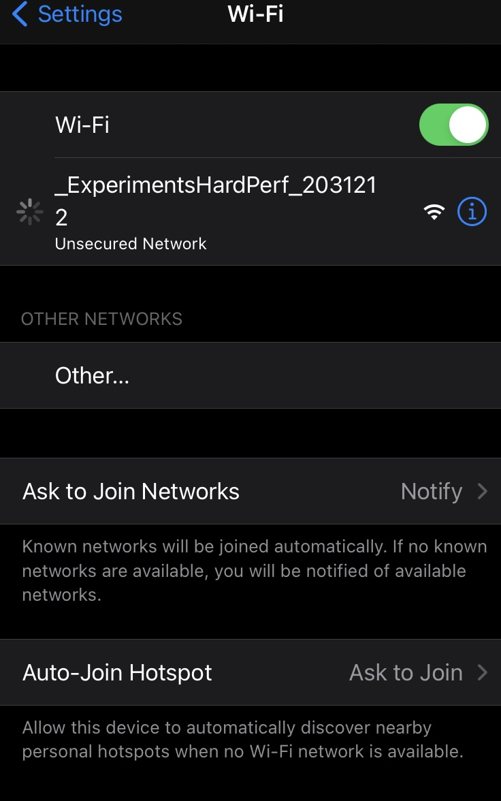

# MicroController- Getting Started

Woo! You got your board on the mail, or maybe we gave it to you in person, now, what is it? What is it for?

This board is based on a ESP32 microcontroller, but it also has some other components to help us get started connecting the digital world and our tangible one. We will go more in depth during class no.4, but for now, here is a quick manual to get you going. 

By default, the board is already pre-programmed, so you don’t have to worry about that. But if you want to make changes, you are more than welcome to do so. We will soon update this same doc to share the code and schematics.

*Note: The board in a bit of an experimental stage and this is the first time we give it to someone else. We already found a couple of mistakes that we manually fixed, but there might be more :)*

 

Each board has a unique name (written by hand on the back of the board). Let’s get the boards connected and start sharing light data!

If you go to the webpage [https://hardwaremovement.com](https://hardwaremovement.com) you will see a grid of boxes, each with a name, one of those names should match the name of your board. If you haven’t connected your board yet, your square should be green. Once the board is connected, it will update grayscale values to this website depending on the lighting conditions. 
    
        

This website is only collecting light information, and since other people will likely connect at different times, feel free to come back and see how the collaborative page is changing over time. Feel free to place the board anywhere indoors and see how that impacts the page. 

## Let’s connect!

### How to connect the board to wifi [video]

[https://vimeo.com/725318091](https://vimeo.com/725318091)

### How to connect the board to wifi step by step

1. Turn on the switch on the ESP32 board. 
    1. You will hear a beep
    2. You will see the board blink about 1x a second, this means that the board is attempting to connect to a wifi network. But because you just got the board it will most likely not be able to connect.
        
            
2. If after 15 seconds it wasn’t able to connect:
    1. The board will beep again
    2. The LED will start blinking at a faster pace (2x second)
    3. It will then make its own wifi network. You can connect to it to share your wifi credentials. You can do this either though your phone or computer’s wifi settings. 
    
    The name of the network will be *ExperimentHardPerf_[random numbers]*
    

1. After 5-10 seconds a login page (captive portal) will show up on your device. 

Note: watch out for upper/lower case

1. Enter your wifi info then click save (Note: watch out for upper/lower case)

Note: watch out for upper/lower case

1. Once you click save, the board will attempt to connect to your network. It will also save your network credentials to it’s internal memory, so you don’t have to add them again (unless you change them). You can now press cancel>use other network, and connect to your regular wifi.

1. If the connection is successful, you will see a quick short flashing LED. Then then you can check the [https://hardwaremovement.com](https://hardwaremovement.com)  website again and see it updating live! The board should then go to sleep and automatically wake up every 20 minutes until it rans out of battery in about a day. If you want, you can charge it again or leave it plugged in. 

### Trouble shooting

- I turn it on but nothing happens, no beep, no flashing led.
    
    Most likely, it’s out of battery, try charging it though the micro USB port
    
- I turn the board on, and it beeps, then it beeps again, and again, and again…
    
    This means that the board is constantly restarting, most likely it’s out of battery, try recharging the battery though it’s Micro USB port
    
- I added my wifi credentials but doesn’t nothing happened.
    
    Try restarting the board by turning it off and on again, the board should attempt to connect and if it still is not able, repeat steps 2-6.
    
    Also, in order to save battery, it will only wait for 1minute before going back to sleep. It could be that it’s taking a bit long to add your wifi credentials.
    
- I was able to connect before now it’s asking for my wifi credentials again
    
    The board only has 15 seconds to successfully connect to wifi, after this it will create it’s own network. Sometimes, these 15 seconds are not enough time connect, no need to add you credentials again, you can restart the board and have it try again. 
    

---

### Additional info: Getting familiar with the board

The board consists of the micocontroller ([ESP32 dev board with a 18650 battery holder](https://wiki.geekworm.com/index.php/WEMOS_ESP32_Board_with_18650_Battery_Holder)) and a series of inputs and outputs:

### **Inputs:**

- **Photoresistor**- This can be used to sense light
- **Tilt Sensor**- This is a binary switch that can be used to read shaking or tilting of the board
- **Potentiometer**- This is a knob can be manually turned
- **Button-** This button has a dual function, to send data while the board is awake, and to wake the board when it is sleeping

### **Outputs:**

- **Buzzer**- This can be programmed to be either a gentle beep or an irritating constant beeeeeeeeeep.
- **An LED output and pin-** this can be used to see changes or to connect to another board or arduino.
- **A Servo-** this can be used to move things in our physical, it can turn about 180°.

### Power

- The ESP32 board has a switch to turn it on/off
- It can be charged/programmed using a micro USB cable
- We added a small switch to let you decide if the board should stay connected or if it should connect every 20 minutes and then go to sleep. This will dramatically impact how long the board can run on battery.
